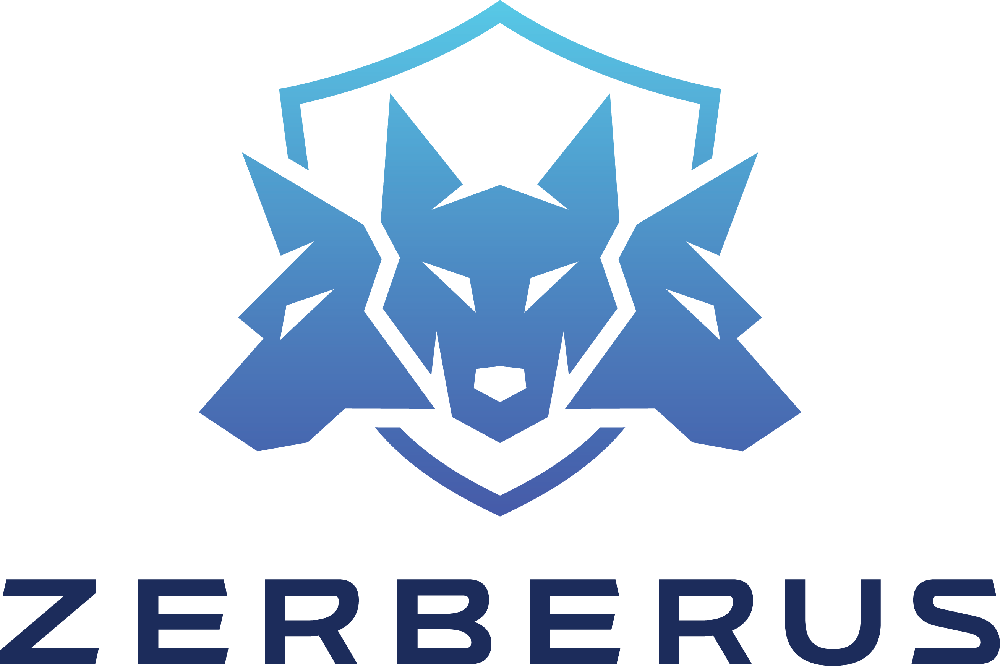

<p align="center">
  
</p>

<h1 align="center">ZSBOM</h1>

<p align="center">
  <strong>Automated SBOM generation and dependency security analysis</strong>
</p>

<p align="center">
  <a href="https://github.com/ZerberusAI/ZSBOM"></a>
  <a href="https://www.python.org/"></a>
  <a href="LICENSE"></a>
  <a href="https://cyclonedx.org/"></a>
</p>

---

## What is ZSBOM?

ZSBOM automates **dependency classification, security validation, and SBOM (Software Bill of Materials) generation** for your software projects. It scans dependencies across multiple ecosystems, identifies vulnerabilities, assesses risk, and produces a standards-compliant [CycloneDX](https://cyclonedx.org/) SBOM — all with a single command.

### Why SBOMs Matter

SBOMs are essential for tracking software composition and are increasingly required under software security regulations such as:

- **Secure Software Development Framework (SSDF)**
- **Cyber Resilience Act (CRA)**
- **NIST Cybersecurity Framework (CSF)**
- **NTIA Minimum Elements for an SBOM (CISA)**

ZSBOM helps developers, security teams, and DevOps engineers stay ahead of these requirements by automating the entire pipeline — from dependency extraction to compliance-ready SBOM output.

### Key Features

- **Multi-Ecosystem Scanning** — Python, JavaScript/NPM, and Java (Maven & Gradle) with full transitive dependency resolution
- **Security Validation** — CVE detection via [OSV.dev](https://osv.dev/), CWE weakness mapping, abandoned package detection, and typosquatting analysis
- **Risk Scoring** — 5-factor scoring framework with configurable weights and thresholds
- **CycloneDX v1.6 SBOM** — Industry-standard output with embedded vulnerability data
- **Single Command** — Auto-detects ecosystems and runs the full pipeline

## Quick Start

```sh
# Install ZSBOM
pip install git+https://github.com/ZerberusAI/ZSBOM.git

# Navigate to your project
cd your-project/

# Run a full scan
zsbom scan
```

> **Note:** [Go 1.21+](https://golang.org/dl/) is required for JavaScript/NPM and Java ecosystem scanning (used to build the [OSV-Scalibr](https://github.com/google/osv-scalibr) integration).

## Supported Ecosystems

| Ecosystem | Detected Files | Transitive Deps |
|-----------|---------------|:---------------:|
| **Python** | `requirements.txt`, `pyproject.toml`, `setup.py`, `setup.cfg`, `Pipfile` | Yes |
| **JavaScript / NPM** | `package.json`, `package-lock.json`, `yarn.lock`, `pnpm-lock.yaml` | Yes |
| **Java (Maven)** | `pom.xml` | Yes |
| **Java (Gradle)** | `build.gradle`, `gradle.lockfile` | Yes |

> More ecosystems (Go, Rust, Ruby, PHP, C#/.NET) are on the [roadmap](#roadmap).

## How It Works

```
 Detect Ecosystems ➜ Extract Dependencies ➜ Validate Security ➜ Assess Risk ➜ Generate SBOM
```

1. **Detect** — Auto-discovers project ecosystems by scanning for manifest and lock files
2. **Extract** — Resolves the full dependency tree, including transitive dependencies
3. **Validate** — Checks every package against CVE databases (OSV.dev), CWE mappings (MITRE), and heuristic checks
4. **Score** — Calculates a per-package risk score across five weighted dimensions
5. **Generate** — Produces a CycloneDX v1.6 SBOM with embedded vulnerability and risk data

## Output

ZSBOM generates the following files in your project root:

| File | Description |
|------|-------------|
| `sbom.json` | CycloneDX v1.6 SBOM with components and vulnerabilities |
| `risk_report.json` | Per-dependency risk scores across all dimensions |
| `dependencies.json` | Full dependency tree with ecosystem and classification metadata |
| `validation_report.json` | CVE and CWE findings from security validation |
| `scan_metadata.json` | Scan context — timestamps, configuration, statistics |

<details>
<summary>Example SBOM component</summary>

```json
{
  "bom-ref": "BomRef.1418539545444415.5659785824827717",
  "name": "@img/sharp-libvips-linuxmusl-arm64",
  "purl": "pkg:npm/%40img/sharp-libvips-linuxmusl-arm64@1.0.4",
  "type": "library",
  "version": "1.0.4"
}
```

</details>

## Risk Scoring

ZSBOM scores every dependency on a 0–100 scale using the **ZSBOM Risk Scoring Framework v1.0**:

| Dimension | Weight | What It Measures |
|-----------|:------:|------------------|
| Known CVEs | 30% | Active vulnerabilities from OSV.dev |
| Package Abandonment | 20% | Maintenance status and commit activity |
| CWE Coverage | 20% | Weakness patterns from MITRE |
| Typosquatting Risk | 15% | Name similarity to popular packages |
| Version Mismatch | 15% | Declared vs. installed version drift |

**Thresholds:** 80–100 = Low Risk, 50–79 = Medium Risk, 0–49 = High Risk

Weights and thresholds are fully configurable via `config.yaml`.

## CLI Usage

```sh
zsbom scan                          # Full scan (default)
zsbom scan -c custom_config.yaml    # Use a custom configuration file
zsbom scan -o output.json           # Override SBOM output path
zsbom scan --skip-sbom              # Run validation and risk assessment only
zsbom scan --ignore-conflicts       # Continue despite dependency conflicts
```

ZSBOM works out of the box with sensible defaults. See [`depclass/config/default.yaml`](depclass/config/default.yaml) for the full configuration reference.

## Continuous Monitoring

For continuous monitoring, CI/CD integration, and team dashboards — explore the [Trace-AI platform](https://trace-ai.dev).

## Roadmap

- SPDX SBOM format support
- Additional ecosystem support — Go, Rust, Ruby, PHP, C#/.NET
- Container image scanning
- Full offline mode with local vulnerability database
- Cross-language dependency detection (C/C++ bundled in Python wheels)
- Performance improvements — multithreading and result pagination

## Contributing

Contributions are welcome! See [CONTRIBUTING.md](CONTRIBUTING.md) for guidelines and [CODE_OF_CONDUCT.md](CODE_OF_CONDUCT.md) for community standards.

## Security

To report a vulnerability, see [SECURITY.md](SECURITY.md).

## Acknowledgments

ZSBOM's multi-ecosystem dependency extraction is powered by [OSV-Scalibr](https://github.com/google/osv-scalibr), an open-source project by Google.

## License

ZSBOM is licensed under the [MIT License](LICENSE). Third-party licenses are documented in [THIRD_PARTY_LICENSES](THIRD_PARTY_LICENSES).
